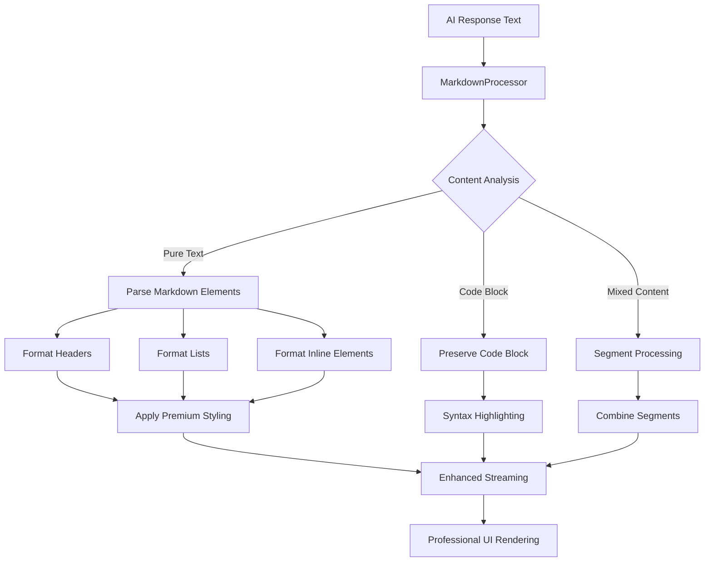

# Complete Markdown Processing Implementation Plan

## Project Overview
Enhance the live interview application to properly process and render markdown formatting in AI responses while maintaining code block integrity and the premium aesthetic.

## Current State Analysis

### ✅ What Currently Works
- Basic word-by-word text streaming animation
- Code block detection and syntax highlighting (```language blocks)
- Premium geometric UI design optimized for compact windows
- Text wrapping and responsive behavior

### ❌ What's Missing
- **No markdown formatting**: Bold (`**text**`), italic (`*text*`), strikethrough
- **No header processing**: `#`, `##`, `###` headers
- **No list formatting**: Bullet points (`-`, `*`) and numbered lists (`1.`)
- **No inline code**: `` `code` `` formatting
- **Poor spacing**: No paragraph separation or proper line breaks
- **No text structure**: Everything appears as plain text

## Architecture Overview



## Implementation Plan

### Phase 1: Core Markdown Processor
**File**: `web/js/markdown-processor.js`

**Features**:
- **Text Formatting**: `**bold**`, `*italic*`, `~~strikethrough~~`, `` `inline code` ``
- **Headers**: `#`, `##`, `###` with proper hierarchy and styling
- **Lists**: Bullet points (`-`, `*`) and numbered lists (`1.`, `2.`)
- **Paragraphs**: Double line breaks create proper paragraph separation
- **Code Protection**: Never process content inside ``` blocks
- **Mixed Content**: Handle markdown + code blocks seamlessly

**Key Methods**:
```javascript
class MarkdownProcessor {
    parseContent(rawText)           // Main parsing entry point
    parseInlineElements(text)       // Bold, italic, inline code
    parseBlockElements(text)        // Headers, lists, paragraphs
    protectCodeBlocks(text)         // Preserve code block integrity
    combineProcessedContent(parts)  // Merge formatted segments
}
```

### Phase 2: Enhanced Streaming Integration
**File**: `web/js/live-streaming.js` (Enhanced)

**Enhancements**:
- Integrate MarkdownProcessor into content pipeline
- Stream formatted elements with appropriate timing
- Handle different streaming speeds for different content types
- Maintain typing cursor positioning during formatting

**Streaming Strategy**:
- **Headers**: Stream as complete units (no word-by-word)
- **Lists**: Stream entire list items at once
- **Paragraphs**: Stream with proper pause between paragraphs
- **Code Blocks**: Maintain existing instant display
- **Inline Formatting**: Stream with formatting applied

### Phase 3: Premium Visual Design
**File**: `web/css/markdown-styles.css` (New)

**Design System**:
- **Headers**: 
  - `H1`: Large, bold with geometric underline
  - `H2`: Medium with left accent border
  - `H3`: Small with subtle highlighting
- **Lists**: 
  - Custom square bullets for consistency
  - Proper indentation and spacing
  - Nested list support
- **Text Formatting**:
  - **Bold**: Increased weight + subtle color enhancement
  - *Italic*: Elegant slant with proper kerning
  - `Inline code`: Geometric background with monospace
- **Spacing**: Professional margins and line heights

**Color Scheme Integration**:
- Headers: White with subtle blue accents
- Lists: Consistent with current text color
- Code: Maintain existing dark theme
- Emphasis: Subtle brightness enhancement

### Phase 4: Content Processing Pipeline

**Enhanced Flow**:
1. **Input**: Raw AI response text
2. **Pre-processing**: Identify and protect code blocks
3. **Markdown Parsing**: Process all markdown elements
4. **Styling Application**: Apply premium CSS classes
5. **Segmentation**: Break into streamable parts
6. **Animation**: Enhanced streaming with proper timing
7. **Rendering**: Professional display in compact UI

### Phase 5: Advanced Features

**Smart Processing**:
- **Nested Lists**: Support for multiple indentation levels
- **Mixed Formatting**: `**bold *italic* text**` combinations
- **Edge Cases**: Handle malformed markdown gracefully
- **Performance**: Efficient parsing without UI blocking
- **Accessibility**: Proper semantic HTML structure

**Interview-Specific Enhancements**:
- **Question Highlighting**: Special formatting for interview questions
- **Approach Headers**: Enhanced styling for solution approaches
- **Code Explanations**: Better integration of code and explanations
- **Step-by-step Lists**: Special formatting for algorithmic steps

## File Structure

```
web/
├── js/
│   ├── markdown-processor.js     # NEW: Core markdown parsing engine
│   ├── live-streaming.js         # ENHANCED: Integrate markdown processing  
│   ├── live-interview.js         # UPDATED: Use enhanced streaming
│   └── ...existing files
├── css/
│   ├── markdown-styles.css       # NEW: Markdown-specific premium styling
│   ├── live-interview.css        # UPDATED: Additional markdown integration
│   └── ...existing files
└── ...existing structure
```

## Technical Specifications

### Markdown Processor Class
```javascript
class MarkdownProcessor {
    constructor(config = {}) {
        this.config = {
            preserveCodeBlocks: true,
            enableNestedLists: true,
            customBullets: true,
            professionalStyling: true,
            ...config
        };
    }

    // Main parsing method
    parseContent(text) {
        // 1. Protect code blocks
        // 2. Parse block elements (headers, lists, paragraphs)
        // 3. Parse inline elements (bold, italic, code)
        // 4. Apply premium styling classes
        // 5. Return structured content for streaming
    }
}
```

### Streaming Integration
```javascript
// Enhanced streaming with markdown support
async streamMarkdownContent(container, content, speed) {
    const processor = new MarkdownProcessor();
    const processedContent = processor.parseContent(content);
    
    for (const segment of processedContent) {
        if (segment.type === 'header') {
            await this.streamCompleteElement(container, segment);
        } else if (segment.type === 'list') {
            await this.streamListItems(container, segment);
        } else if (segment.type === 'code') {
            this.addCodeBlock(container, segment.content, segment.language);
        } else {
            await this.streamFormattedText(container, segment, speed);
        }
    }
}
```

## Quality Assurance

### Test Cases
1. **Pure Markdown**: Headers, lists, formatting only
2. **Mixed Content**: Markdown + code blocks
3. **Complex Nesting**: Nested lists with formatting
4. **Edge Cases**: Malformed markdown, empty elements
5. **Performance**: Large responses with multiple elements
6. **Visual**: Consistency across different window sizes

### Success Criteria
- ✅ All markdown elements render correctly with premium styling
- ✅ Code blocks remain unaffected and properly highlighted
- ✅ Streaming animation works smoothly with formatted content
- ✅ Responsive design maintains compact window optimization
- ✅ Professional aesthetic is preserved and enhanced
- ✅ Performance remains optimal without UI blocking

## Implementation Priority

### Phase 1 (Core): Week 1
- Create MarkdownProcessor class
- Implement basic text formatting (bold, italic, code)
- Add header parsing and styling
- Create basic list processing

### Phase 2 (Integration): Week 1
- Enhance LiveStreaming module
- Integrate markdown processor
- Update streaming animations
- Add premium CSS styles

### Phase 3 (Polish): Week 2
- Handle edge cases and nested elements
- Performance optimization
- Advanced features (nested lists, mixed formatting)
- Comprehensive testing

### Phase 4 (Enhancement): Week 2
- Interview-specific formatting
- Accessibility improvements
- Final polish and optimization
- Documentation and examples

## Expected Outcomes

### User Experience
- **Professional Formatting**: AI responses look polished and well-structured
- **Enhanced Readability**: Proper spacing, headers, and lists improve comprehension
- **Consistent Design**: Markdown elements integrate seamlessly with premium aesthetic
- **Smooth Animation**: Enhanced streaming maintains visual appeal
- **Compact Optimization**: All features work perfectly in small windows

### Technical Benefits
- **Maintainable Code**: Clean architecture with separated concerns
- **Extensible Design**: Easy to add new markdown features
- **Performance Optimized**: Efficient processing without UI lag
- **Robust Handling**: Graceful degradation for malformed content
- **Future-Ready**: Foundation for additional formatting features

## Next Steps

1. **Approve Plan**: Review and confirm implementation approach
2. **Begin Implementation**: Start with Phase 1 (Core Markdown Processor)
3. **Iterative Development**: Implement and test each phase
4. **Integration Testing**: Ensure seamless integration with existing features
5. **Final Polish**: Optimize performance and visual consistency

This comprehensive plan will transform the interview application's text rendering from basic streaming to professional, markdown-formatted content that enhances the user experience while maintaining the premium aesthetic and compact window optimization.