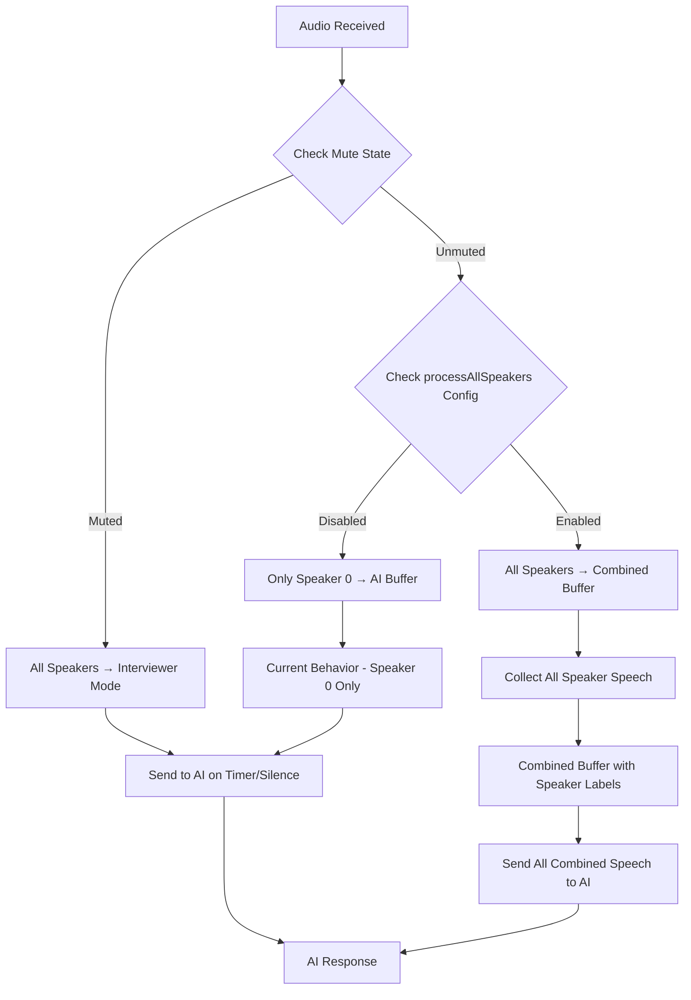

# Process All Speakers Feature - Implementation Plan

## Overview
Implement a global configuration option that allows the AI to process and respond to speech from ALL speakers (interviewer, candidate, and any additional speakers) when enabled, rather than just the interviewer.

## Current Behavior Analysis

### Existing Logic:
- **When Muted**: All speakers → treated as interviewer (Speaker 0) → AI processes
- **When Unmuted**: Only interviewer (Speaker 0) → AI processes, candidate (Speaker 1+) → ignored

### New Feature Requirements:
- **Global Config**: `processAllSpeakers` (default: `true`)
- **When Unmuted + Config Enabled**: ALL speakers → combined and sent to AI
- **Buffer Logic**: Collect speech from all speakers, process when silence/timer expires
- **Backward Compatibility**: When config disabled, maintain current behavior

## Implementation Architecture



## Detailed Implementation Steps

### 1. Frontend Configuration Enhancement
**File**: `web/js/live-interview.js`
**Lines**: 384+ (after existing global functions)

#### Add Global Control Functions:
```javascript
// Process All Speakers Configuration
window.setProcessAllSpeakers = (enabled) => {
    if (appState.socket && appState.socket.readyState === WebSocket.OPEN) {
        sendSocketMessage('config_update', {
            processAllSpeakers: enabled
        });
    }
    console.log(`🎯 Process All Speakers ${enabled ? 'enabled' : 'disabled'}`);
};

window.enableAllSpeakers = () => {
    window.setProcessAllSpeakers(true);
    console.log('🎯 All speakers mode activated - AI will respond to everyone');
};

window.disableAllSpeakers = () => {
    window.setProcessAllSpeakers(false);
    console.log('🎯 Interviewer-only mode activated - AI will only respond to interviewer');
};
```

### 2. Backend Session State Enhancement
**File**: `api/websocket.py`
**Lines**: 24 (modify session_state initialization)

#### Current:
```python
session_state = {"is_muted": False}
```

#### Enhanced:
```python
session_state = {
    "is_muted": False,
    "process_all_speakers": True  # Default enabled as requested
}
```

### 3. WebSocket Message Handler Enhancement
**File**: `api/websocket.py`
**Lines**: 86+ (in message handling loop)

#### Add Config Update Handler:
```python
elif data['type'] == 'config_update':
    payload = data.get('payload', {})
    if 'processAllSpeakers' in payload:
        session_state["process_all_speakers"] = payload['processAllSpeakers']
        print(f"🎯 Process All Speakers config updated: {session_state['process_all_speakers']}")
```

### 4. Enhanced Transcript Processing Logic
**File**: `api/websocket.py`
**Lines**: 40-76 (modify `on_transcript` function)

#### Current Logic (Speaker 0 only):
```python
effective_speaker = 0 if session_state["is_muted"] else speaker

if transcript and effective_speaker == 0:
    transcript_buffer += transcript + " "
    # Process buffer...
```

#### Enhanced Logic (All Speakers):
```python
# --- Enhanced Mute-Aware Speaker Logic ---
if session_state["is_muted"]:
    # When muted, treat all speakers as interviewer
    should_process = True
    speaker_label = "Interviewer"
elif session_state["process_all_speakers"]:
    # When process all speakers enabled, process everyone
    should_process = True
    speaker_label = f"Speaker {speaker}" if speaker is not None else "Unknown Speaker"
else:
    # Legacy behavior - only process speaker 0 (interviewer)
    should_process = (speaker == 0)
    speaker_label = "Interviewer"

if transcript and should_process:
    # Add speaker-labeled transcript to buffer
    labeled_transcript = f"{speaker_label}: {transcript}"
    transcript_buffer += labeled_transcript + " "
    
    if buffer_timer and not buffer_timer.done():
        buffer_timer.cancel()
    
    if is_final:
        async def delayed_processing():
            await asyncio.sleep(1.2)
            await process_buffered_transcript()
        
        buffer_timer = asyncio.create_task(delayed_processing())
```

### 5. Initial Configuration Setup
**File**: `api/websocket.py`
**Lines**: 95 (in start_interview handler)

#### Enhanced Start Interview:
```python
session_state["is_muted"] = payload.get('is_muted', False)
session_state["process_all_speakers"] = payload.get('process_all_speakers', True)  # Default enabled
```

### 6. Frontend Integration
**File**: `web/js/main.js`
**Lines**: 268-272 (in startInterview function)

#### Enhanced Start Interview Message:
```javascript
sendSocketMessage('start_interview', {
    aiProvider: appState.selectedProvider,
    onboardingData: appState.onboardingData,
    is_muted: isMicrophoneMuted(),
    process_all_speakers: true, // Default enabled
});
```

## Configuration Modes

### Three Operating Modes:

1. **Muted Mode** (Existing)
   - All speakers → treated as interviewer
   - AI processes all speech
   - Use case: Observation mode, multiple interviewers

2. **Process All Speakers Mode** (New - Default)
   - `process_all_speakers = true`
   - All speakers → combined buffer with labels
   - AI processes everyone's speech
   - Use case: Panel interviews, group discussions

3. **Interviewer Only Mode** (Existing)
   - `process_all_speakers = false`
   - Only Speaker 0 → AI processes
   - Use case: Traditional 1-on-1 interviews

## Expected Output Format

### Combined Speaker Buffer Example:
```
Speaker 0: What's your experience with React?
Speaker 1: I have about 3 years of experience with React, mostly building single-page applications.
Speaker 0: Can you explain React hooks?
Speaker 2: Actually, I'd like to add that hooks are a great feature introduced in React 16.8.
Speaker 1: Yes, hooks allow you to use state and lifecycle methods in functional components.
```

## Benefits

✅ **Panel Interviews**: Multiple interviewers can ask questions, AI responds to all  
✅ **Group Discussions**: Capture full conversation context  
✅ **Flexible Control**: Easy toggle via global functions  
✅ **Better Context**: AI gets complete conversation for better responses  
✅ **Smart Buffering**: Waits for natural pauses before processing  
✅ **Backward Compatibility**: Existing functionality preserved  
✅ **Real-time Config**: Can change settings during active interview  

## Global Control Functions Usage

```javascript
// Enable processing all speakers (default)
enableAllSpeakers();

// Disable - only process interviewer
disableAllSpeakers();

// Custom toggle
setProcessAllSpeakers(true/false);
```

## Testing Scenarios

1. **Single Interviewer**: Should work exactly as before when `process_all_speakers = false`
2. **Panel Interview**: Multiple interviewers asking questions, AI responds to all
3. **Candidate + Interviewer**: Both sides of conversation processed
4. **Muted Mode**: All speakers treated as interviewer (existing behavior)
5. **Real-time Toggle**: Change configuration during active interview

## Implementation Priority

1. ✅ Backend session state enhancement
2. ✅ Enhanced transcript processing logic  
3. ✅ WebSocket message handler for config updates
4. ✅ Frontend global control functions
5. ✅ Integration with start interview flow
6. ✅ Testing and validation

## Backward Compatibility

- Default behavior: `process_all_speakers = true` (as requested)
- Existing interviews continue working without changes
- No breaking changes to mute/unmute functionality
- Legacy single-speaker processing available via configuration

This implementation provides complete flexibility for any interview scenario while maintaining all existing functionality.